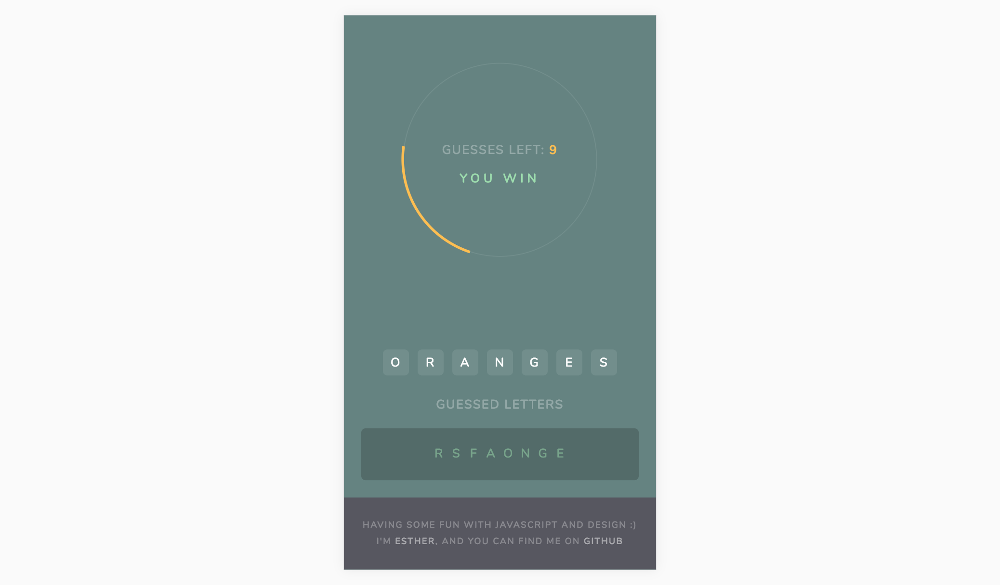

## Hangman

View [live game here](https://mindplace.github.io/hangman/).

Very vanilla JS and a focus on design resulted in this lovely little project. There may not be a real hangman, though!

## Technologies

* OOP vanilla JavaScript (without any jQuery support)
* [Jasmine](https://jasmine.github.io/) for JavaScript testing
* HTML & CSS
* [Coolers](https://coolors.co/3d3522-4a442d-386150-58b09c-caf7e2) for great color palette ideas.
